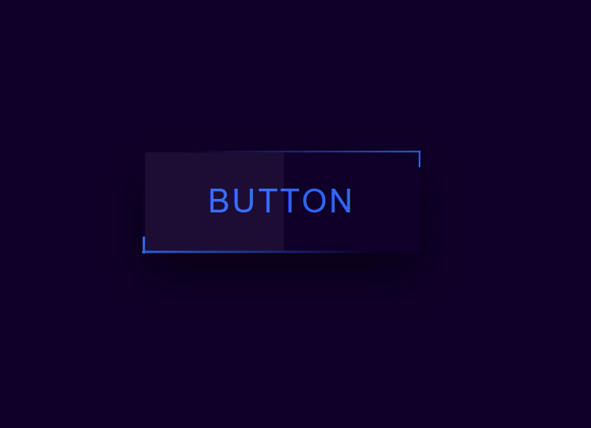

# Frontend-Fun
Snake Animated Button

## Learnings
The overflow property should be applied to the parent element to control the behavior of child elements' overflow content. This is because the parent is the container that can either allow or restrict content from spilling out.


In CSS, the overflow property controls what happens to content that overflows an element's box. There are several possible values:

1. visible: Default value. Overflowing content is not clipped and will be rendered outside the element's box.
2. hidden: Overflowing content is clipped, and the rest is invisible.
3. scroll: Overflowing content is clipped, but scrollbars are added to view the rest of the content.
4. auto: Overflowing content is clipped, and scrollbars appear only when necessary.

```html
<div class="parent">
    <div class="child">Some long content that overflows the parent container.</div>
</div>
```

```css
  .parent {
      width: 200px;
      height: 100px;
      overflow: auto;
      border: 1px solid black;
  }

  .child {
      width: 300px;
      height: 150px;
  }
```
The default behavior for the overflow property in CSS is visible. This means that if the content inside an element exceeds the size of the container, the excess content will not be clipped and will be rendered outside the element's box, making it visible.

## Demo

