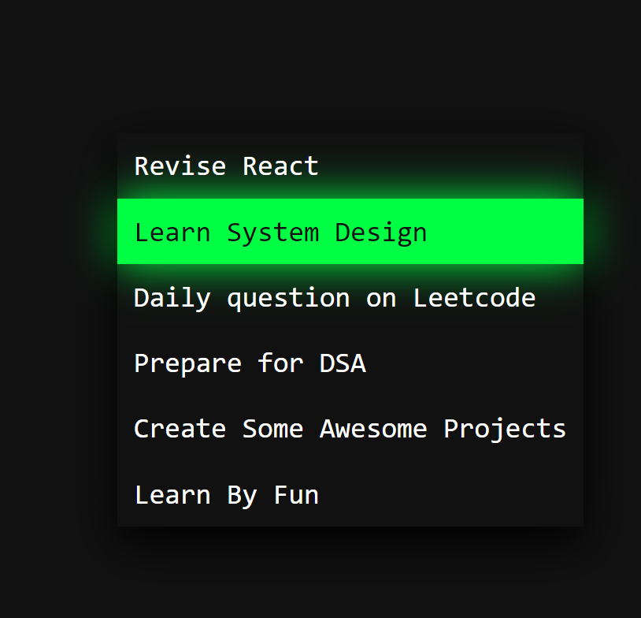

# Frontend-Fun
Box loader

## Learnings
[Learn ::before and ::after] (https://www.youtube.com/watch?v=zGiirUiWslI)

::before and ::after pseudo-elements in CSS are powerful tools for adding content before or after an element's actual content. Here's how they work:
```css
  /* ::before example */
  .element::before {
      content: "Prefix: ";
      color: blue;
  }

  /* ::after example */
  .element::after {
      content: " :Suffix";
      color: red;
  }
```
::before: Inserts content before the element's content.
::after: Inserts content after the element's content.
content: This property is required and defines what content to insert.


###Position
When you set a child element to position: absolute, it is positioned relative to the nearest positioned ancestor. If no ancestor is positioned (i.e., has position set to relative, absolute, or fixed), the child will be positioned relative to the initial containing block (usually the viewport). Setting position: relative on the parent ensures the child is positioned relative to this parent, providing more predictable and controlled positioning within the parent container.
```html
  <div class="parent">
      <div class="child">Child</div>
  </div>
```
```css
.parent {
    position: relative; /* Ensure child is positioned relative to this parent */
    width: 200px;
    height: 200px;
    background-color: lightgray;
}

.child {
    position: absolute; /* Positioned relative to the .parent element */
    top: 10px;
    left: 10px;
    background-color: lightblue;
}
```
Without position: relative on the parent, the child would be positioned relative to the next positioned ancestor or the initial containing block, often resulting in unexpected layouts.


```css
  /*in our code*/
  /*Added postion here even though it was not require, just to make position absolute for ::before to take this as it's parent */
  ul li{
      position: relative;
  }
```


## Demo

