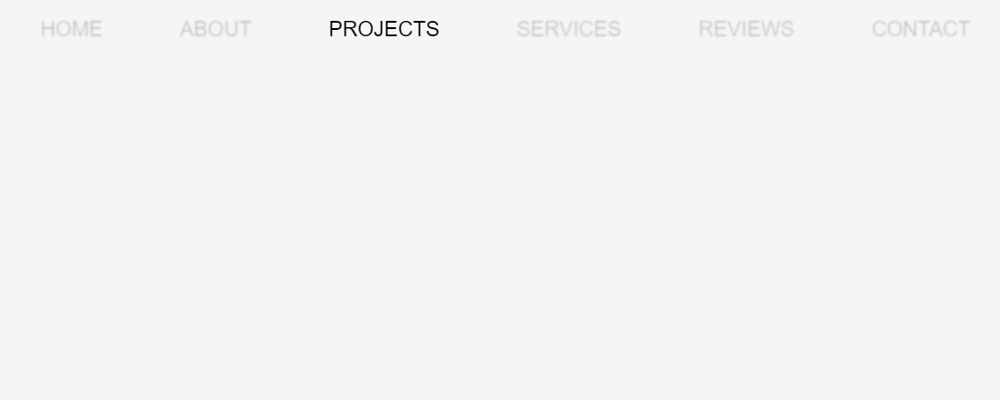

# Frontend-Fun
Blur Effect

## Learnings

```css
/* apply filter to all and again filter to specific to create such effect */
  ul:hover li{
    opacity: 0.2;
    filter: blur(1px);
  }

  ul li:hover{
    opacity:1;
    filter:blur(0px);
  }

```

The selectors ul:hover li and ul:hover differ in scope and effect:

## ul:hover li:
This selector targets all <li> elements within a <ul> when the <ul> itself is being hovered over.
Example effect: Changes the style of all list items when the user hovers over the list.
css
```css
ul:hover li {
    color: red;
}
```

## ul:hover:
This selector targets the <ul> element itself when it is being hovered over.
Example effect: Changes the style of the entire list when the user hovers over it.
```css

ul:hover {
    background-color: yellow;
}
```

Adding li at the end of the selector changes the focus from the entire list (ul) to the individual list items (li).


##Demo
